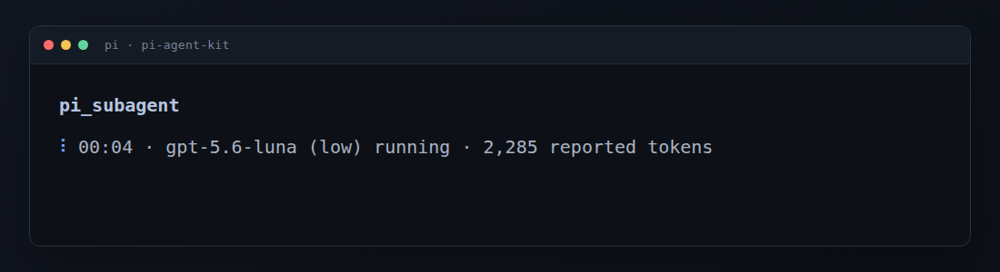
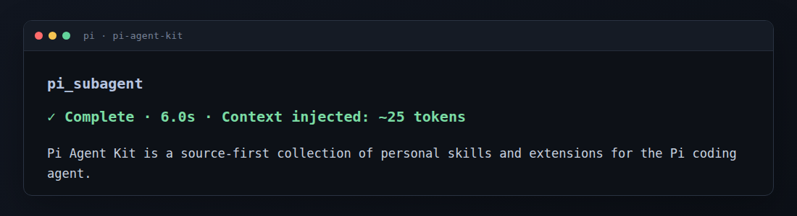

# Pi Agent Kit

> Inspectable, copy-friendly skills and extensions for the [Pi coding agent](https://github.com/earendil-works/pi).

Pi Agent Kit is the public, source-first collection of resources I currently use or have tested in my own workflow. It is for people who prefer to adopt one small, understandable component at a time instead of installing a complete agent framework.

- **Skills** provide focused workflows that Pi loads on demand.
- **Extensions** add tools or enforce runtime boundaries.
- **Live** resources are currently used and maintained.
- **Retired** resources remain available as references.

The collection follows a set of [harness-minimalism principles](PRINCIPLE.md): read the source, take what is useful, and adapt it to your own workflow. It is not published as an npm package or maintained as an install-everything Pi package.

## Start here

| If you want to… | Start with | Type |
| --- | --- | --- |
| Turn a vague repository change into an executable plan | [`deep-plan`](live/skills/deep-plan/SKILL.md) | Skill |
| Isolate noisy investigation from the main context | [`pi-subagent`](live/extensions/pi-subagent/README.md) | Skill + extension |
| Analyze patterns across local Pi sessions | [`session-search`](live/skills/session-search/README.md) | Skill |
| Run project commands inside an offline Linux boundary | [`whitebox`](live/extensions/whitebox/README.md) | Extension |

## Getting started

1. Choose one resource from the table above.
2. Read its linked documentation, requirements, and security assumptions.
3. Copy or link only that resource into the applicable Pi location, following its component-specific setup.
4. Restart Pi, or use `/reload` for an auto-discovered resource.

For example, to try the standalone `deep-plan` skill from a checkout:

```bash
git clone https://github.com/MDGChamomile/pi-agent-kit.git
mkdir -p ~/.pi/agent/skills
cp -R pi-agent-kit/live/skills/deep-plan ~/.pi/agent/skills/
```

> [!CAUTION]
> Skills can instruct the model to take actions, and extensions run with the user's system permissions. Review each resource before adopting it.

## Live

Resources currently used and maintained.

### Skills

| Skill | Purpose | Invoke | Usage |
| --- | --- | --- | --- |
| [`pi-subagent`](live/skills/pi-subagent/SKILL.md) | Delegate noisy local-file or public-web investigation and return only a bounded final answer | Model-selected or `/skill:pi-subagent` | ◎ Primary |
| [`deep-plan`](live/skills/deep-plan/SKILL.md) | Turn a vague repository change into an aligned execution record | `/skill:deep-plan` | ◐ Regular |
| [`session-search`](live/skills/session-search/README.md) | Aggregate counts, errors, and tool or skill usage across local Pi sessions | `/skill:session-search` | ◐ Regular |

### Extensions

| Extension | Purpose | Platform | Usage |
| --- | --- | --- | --- |
| [`pi-subagent`](live/extensions/pi-subagent/README.md) | Run bounded, isolated, read-only local or public-web investigations outside the parent context | Portable (tested on Linux) | ◎ Primary |
| [`whitebox`](live/extensions/whitebox/README.md) | Run project commands and Pi file tools inside a strict offline Bubblewrap boundary | Linux | ○ Situational |

**Usage:** `◎ Primary` is central and most frequently used; `◐ Regular` is used repeatedly; `○ Situational` serves a narrower, occasional need.

### Pi Subagent in action

The status and result below came from a real local lookup against this repository and were rendered without machine-specific paths or account details.

**Running**



**Complete**



## Retired

Resources kept for reference but no longer actively used or maintained.

| Resource | Purpose |
| --- | --- |
| [`git-history`](retired/extensions/git-history/index.ts) | Add `/snapshot` to review and commit changes in the Pi agent directory |
| [`meta-prompt`](retired/skills/meta-prompt/SKILL.md) | Write or improve a compact, ready-to-use prompt |
| [`nomore-harness`](retired/skills/nomore-harness/SKILL.md) | Review proposed additions to a Pi environment before adoption |

## Contributing

This is an opinionated personal collection, but issues and suggestions are welcome. See [CONTRIBUTING.md](CONTRIBUTING.md).

## License

[MIT](LICENSE)
