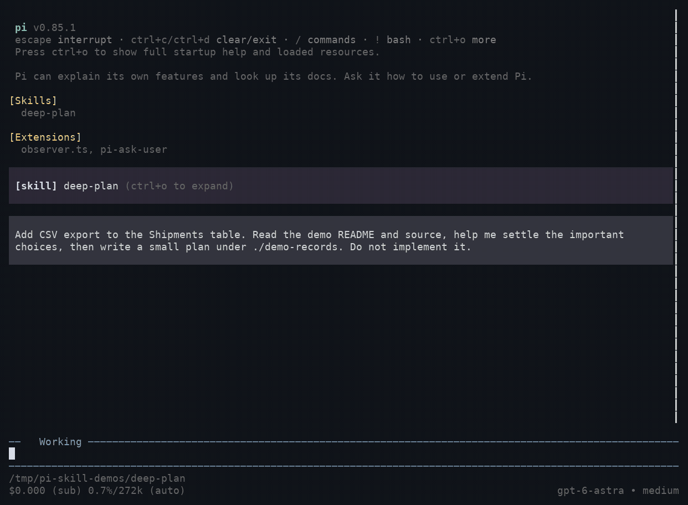

# Deep Plan

An explicitly invoked [Pi](https://github.com/earendil-works/pi) skill for turning a vague repository change into an executable plan: **Fog → Same Page → Execution Record**. The agent inspects available evidence, asks about decisions that remain unresolved, and writes a plan only after alignment. Planning does not authorize implementation.

## In action

A real Pi run on **Parcel Dashboard**, a synthetic shipping dashboard: clarify CSV export scope, resolve the missing UI boundary, confirm the shared understanding, then create `PLAN.md` without implementing the feature.



The GIF replays actual terminal output with typing and waits accelerated; model responses and tool results are not scripted. The fixture is not a Git repository, so its Git-status check fails visibly; the agent records that limitation and completes the plan. This is a workflow demonstration, not a measure of planning quality or latency.

## Requirements and installation

- Pi with skill commands enabled.
- A compatible `ask_user` tool for decision gates. [pi-ask-user](https://github.com/edlsh/pi-ask-user) is the reference implementation; copying this skill does not install it.
- Node.js for the bundled no-clobber plan publication helper.

From the repository root, copy the directory into Pi's skill location:

```bash
mkdir -p ~/.pi/agent/skills
cp -R live/skills/deep-plan ~/.pi/agent/skills/
```

Restart Pi or use `/reload`, then invoke it explicitly from the target project:

```text
/skill:deep-plan Help me define a CSV export change before implementation.
```

Read [`SKILL.md`](SKILL.md) for the workflow and critical-gate behavior. The skill is not automatically selected by the model.

## Output and boundaries

Inspection and alignment are read-only. Once alignment is confirmed, the skill creates a new record directory containing an authoritative `PLAN.md`; it adds specs or tickets only when the work needs them. The default destination is under the installed skill's `records/` directory, partitioned by project, unless you explicitly choose another records root for that run. Existing records are never overwritten.

The completed record separates confirmed alignment, readiness, and execution authorization. Missing evidence can leave execution blocked; implementation always requires a separate explicit request. See the [execution-record contract](references/execution-record.md) for details and [behavior evaluations](references/behavior-evals.md) for maintenance checks.

## License

[MIT](LICENSE). Keep the bundled license notice when copying or redistributing this skill.
